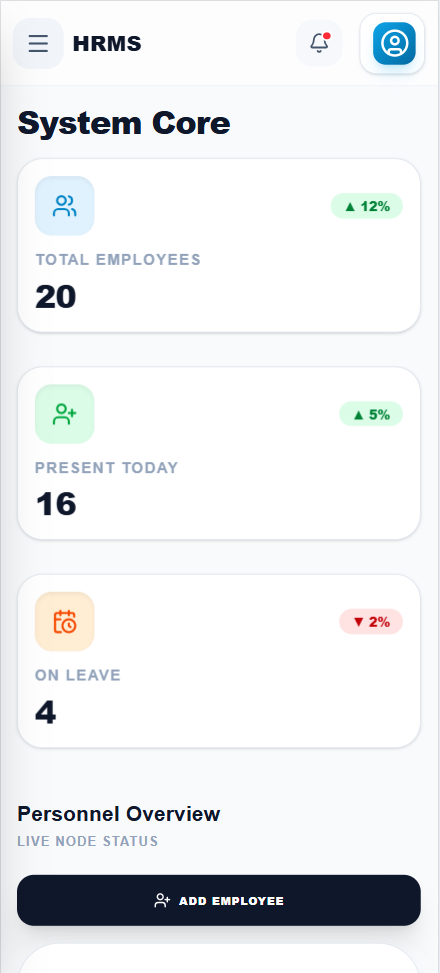

# SJCET Enterprise HRMS Dashboard

[](https://reactjs.org/)
[](https://vitejs.dev/)
[](https://tailwindcss.com/)
[](LICENSE.md)

> [!IMPORTANT]
> **Institutional Sovereign System**: Developed exclusively for St. Joseph's College of Engineering and Technology. This project features a proprietary **Auto-Healing Protocol** and **Zero-Failure Architecture**.

## 📑 Portfolio Overview
A professional, high-security Human Resource Management System (HRMS) designed to manage institutional personnel with precision. The system transitions from a secure multi-layer login to an interactive data mesh featuring real-time analytics and personnel directory management.

## 🚀 Advanced Features
- **🛡️ Auto-Healing Protocol**: Integrated `SystemPhysician` logic that audits and repairs corrupted state in real-time.
- **🔒 Secure Auth Node**: Protected routes with session isolation and persistence.
- **📊 Interactive Analytics**: Real-time stats calculation (Total, Present, On-Leave) with animated data visualizations.
- **📑 institutional Export Utility**: Real-world CSV generation for Staff Directories and Payroll reports.
- **📱 Universal Responsiveness**: Pixel-perfect adaptation for Desktop, Tablet, and Mobile viewports.

## 🏗️ Technical Architecture

### 📂 Folder Structure
```text
college-hrms-dashboard/
├── .github/            # CI/CD Workflows
├── public/             # Static Assets
├── src/
│   ├── components/     # Atomic UI Units (Sidebar, Header, Table, Modals)
│   ├── context/        # Global State Centers (AuthContext)
│   ├── pages/          # Full-Page Layouts (Login, Dashboard)
│   ├── utils/          # System Logic (SystemPhysician, Data Helpers)
│   ├── App.jsx         # System Core & Route Configuration
│   ├── data.json       # Institutional Node Database
│   └── main.jsx        # Project Entry Point
└── tailwind.config.js  # Precision Design Tokens
```

### 🧩 Component Architecture
- **Layout Management**: Shared `DashboardLayout` logic with animated sidebar transitions.
- **Transactional Modals**: Modular `AddEmployeeModal` with multi-field validation.
- **State Synchronization**: Centralized state management ensuring `StatsCard` and `EmployeeTable` sync instantly during CRUD operations.

## 📸 Screenshots

| Desktop View | Mobile View |
| :---: | :---: |
|  |  |
|  |  |

> [!NOTE]
> *Screenshots are located in the `/screenshots` directory for evaluation.*

## 🛠️ Local Deployment
1. **Repository Synchronization**:
   ```bash
   git clone https://github.com/ansonsaju/College-HRMS-Dashboard-UI
   cd college-hrms-dashboard
   ```
2. **Dependency Installation**:
   ```bash
   npm install
   ```
3. **Execution**:
   ```bash
   # Development Mode
   npm run dev
   # Production Build
   npm run build
   ```

## 🔑 Access Protocols
- **Authorized Node**: `admin@sjcet.ac.in`
- **Security Token**: `admin123`

---
**Lead Developer**: Sajus  
**Institution**: St. Joseph's College of Engineering and Technology (SJCET)
